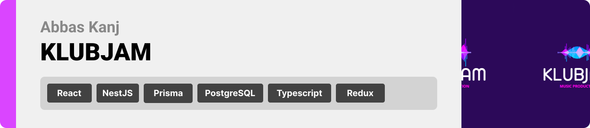
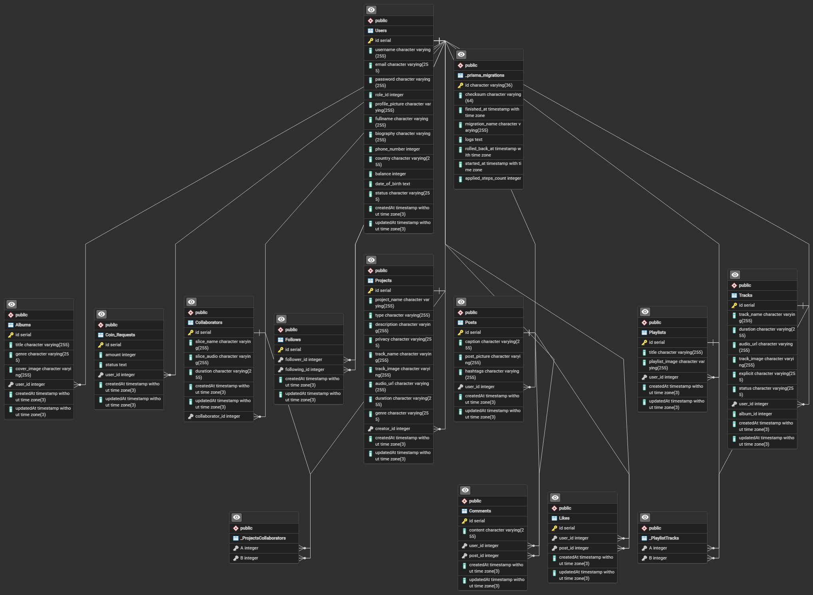

<br><br>

<!-- project philosophy -->


> KLUBJAM revolutionizes music collaboration and discovery. It offers a workspace for project collaboration, a community feed for interaction, a music feed for playlist browsing, and AI-generated sound capabilities.

### User Stories

#### Musician

- As a musician, I want to be able to produce music alone or collaborate with other musicians on a song project, so that I can create high-quality music and expand my creative opportunities.
- As a musician, I want to be able to post my latest work on the feed, so that musicians can interact with me, provide feedback, and stay updated on my musical endeavors.
- As a musician, I want to be able to use AI to generate my own music by inputting text and specifying my favorite artist, so that I can create unique and personalized music tracks.
  <br>

#### Admin

- As an admin, I want to view analytics of the entire website, including user activity and engagement metrics, so that I can make informed decisions to improve the platform.
- As an admin, I want to be able to manage user accounts, including creating, editing, updating, suspending, banning, or deleting musician and moderator accounts, to maintain a safe and respectful community.
- As an admin, I want to have the ability to moderate content by updating or deleting tracks uploaded by musicians and posts made by users, to ensure the quality and appropriateness of the platform's content.
  <br>

#### Moderator

- As a moderator, I want to be able to approve or reject produced tracks by musicians, so that I can ensure that only high-quality music is showcased on the platform.
- As a moderator, I want to be able to edit or delete comments made by musicians on a certain post, to maintain a respectful and constructive environment.
- As a moderator, I want to be able to report any issues or violations to the admin, so that they can take appropriate action to address them and maintain the integrity of the platform.

<br><br>

<!-- Tech stack -->


### KLUBJAM is built using the following technologies:

- This project uses the [React development framework](https://react.dev/). React is a popular JavaScript library for building user interfaces. React allows for the creation of reusable UI components, ensuring a dynamic and responsive user experience.
- The project leverages [Redux](https://redux.js.org/). Redux is used for state management, providing a predictable state container. This ensures efficient data flow throughout the application.
- The project uses [NestJS](https://nestjs.com/). NestJS is a progressive Node.js framework for building scalable and maintainable server-side applications. NestJS leverages TypeScript, enhancing code quality and maintainability with strong typing and modern JavaScript features.
- The project leverages [Tone.js](https://tonejs.github.io/). Tone.js is a powerful JavaScript framework for creating and manipulating audio in the web browser, enabling dynamic and interactive sound experiences.
  <br><br>

<!-- UI UX -->


> We designed KLUBJAM using wireframes and mockups, iterating on the design until we reached the ideal layout for easy navigation and a seamless user experience.

- Project Figma design [figma](https://www.figma.com/design/AdFpHZHqfDga3fu1TE4QB2/KLUBJAM?node-id=0-1&t=MsWQ7YJPFsrEGOuV-0)

### Mockups

| Home screen                                  | Community Screen                        | Explore Screen                             |
| -------------------------------------------- | --------------------------------------- | ------------------------------------------ |
|  |  |  |

<br><br>

<!-- Database Design -->


### Architecting Data Excellence: Innovative Database Design Strategies:



<br><br>

<!-- Implementation -->


### Musician Screens (Web)

| Login popup                               | Register popup                          | Landing screen                          | Loading screen                          |
| ----------------------------------------- | --------------------------------------- | --------------------------------------- | --------------------------------------- |
|  |  |      |  |
| Home screen                               | Menu Screen                             | Order Screen                            | Checkout Screen                         |
|  |  |  |  |

### Admin Screens (Web)

| Login screen                            | Register screen                       | Landing screen                        |
| --------------------------------------- | ------------------------------------- | ------------------------------------- |
|  |  |  |
| Home screen                             | Menu Screen                           | Order Screen                          |
|  |  |  |

### Moderator Screens (Web)

| Login screen                            | Register screen                       | Landing screen                        |
| --------------------------------------- | ------------------------------------- | ------------------------------------- |
|  |  |  |
| Home screen                             | Menu Screen                           | Order Screen                          |
|  |  |  |

<br><br>

<!-- Prompt Engineering -->


### Mastering AI Interaction: Unveiling the Power of Prompt Engineering:

- This project uses advanced prompt engineering techniques to optimize the interaction with natural language processing models. By skillfully crafting input instructions, we tailor the behavior of the models to achieve precise and efficient language understanding and generation for various tasks and preferences.

<br><br>

<!-- AWS Deployment -->


### Efficient AI Deployment: Unleashing the Potential with AWS Integration:

- This project leverages AWS deployment strategies to seamlessly integrate and deploy natural language processing models. With a focus on scalability, reliability, and performance, we ensure that AI applications powered by these models deliver robust and responsive solutions for diverse use cases.

<br><br>

<!-- Unit Testing -->


### Precision in Development: Harnessing the Power of Unit Testing:

- This project employs rigorous unit testing methodologies to ensure the reliability and accuracy of code components. By systematically evaluating individual units of the software, we guarantee a robust foundation, identifying and addressing potential issues early in the development process.

<br><br>

<!-- How to run -->


> To set up KLUBJAM locally, follow these steps:

### Prerequisites

This is an example of how to list things you need to use the software and how to install them.

- npm
  ```sh
  npm install npm@latest -g
  ```

### Installation

_Below is an example of how you can instruct your audience on installing and setting up your app. This template doesn't rely on any external dependencies or services._

1. Get a free API Key at [example](https://example.com)
2. Clone the repo
   git clone [github](https://github.com/your_username_/Project-Name.git)
3. Install NPM packages
   ```sh
   npm install
   ```
4. Enter your API in `config.js`
   ```js
   const API_KEY = "ENTER YOUR API";
   ```

Now, you should be able to run KLUBJAM locally and explore its features.
